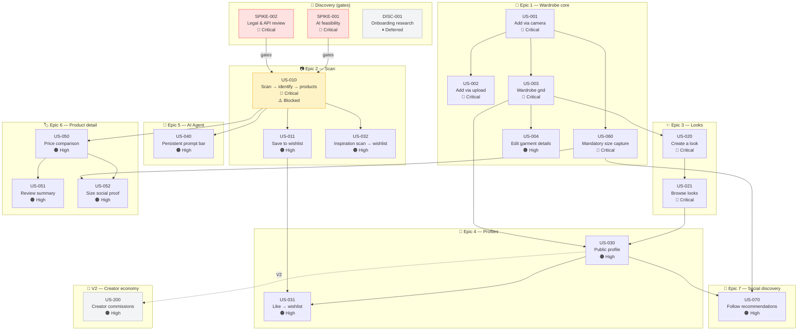
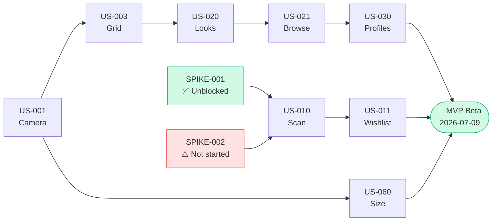

# Epic & Story Dependencies
**Atelier — Full backlog map**
Last updated: 2026-04-17

## Reading this diagram

- **Red border** = critical priority
- **Orange border** = high priority
- **Yellow fill** = currently blocked (waiting for spike results)
- **Grey fill** = deferred (V2 or paused)
- **Solid arrow** = hard dependency (cannot build without)
- **Dashed arrow** = soft dependency (can build independently but related)

## Critical path to MVP launch

