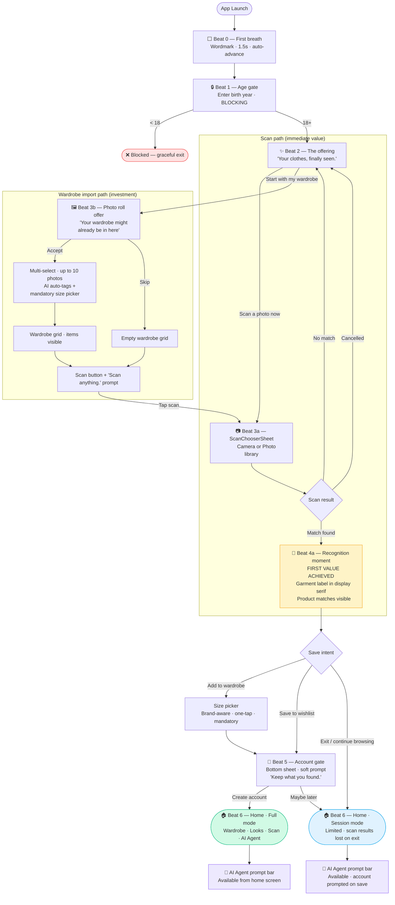

# User Flow — Onboarding
**Atelier — First launch to first value**
Last updated: 2026-04-17

## Legend

| Symbol | Meaning |
|--------|---------|
| 🔒 | Blocking step — cannot skip |
| ✨ | Key emotional beat |
| 🎯 | First value moment |
| 🔐 | Account gate |
| 🏠 | Post-onboarding home |
| 💬 | AI agent surface |

## Key decisions encoded in this flow

- Age gate is the only blocking step
- Account creation deferred to first save action
- Both paths (scan + import) converge at the recognition moment
- Guest mode is permanent — "Maybe later" leads to a real usable state, not a dead end
- AI agent is available from home in both modes
