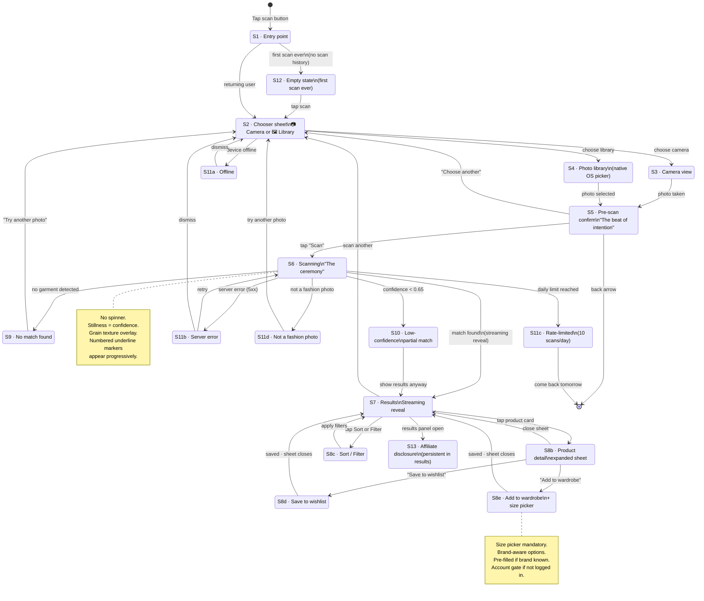

# State Machine — Scan Moment
**Atelier — US-010 · 13 states**
Last updated: 2026-04-17

## State inventory

| State | Name | Key design decision |
|-------|------|---------------------|
| S1 | Entry point | 3 locations: home, wardrobe, photo view |
| S2 | Chooser sheet | Bottom sheet — not modal overlay |
| S3 | Camera view | No reticle, no guide — full viewfinder |
| S4 | Photo library | Native OS picker — no custom implementation |
| S5 | Pre-scan confirm | "Beat of intention" — retained by design |
| S6 | Scanning ceremony | No spinner — stillness signals confidence |
| S7 | Results | Photo stays full-bleed, panel rises from bottom |
| S8b | Product detail | Bottom sheet (70% viewport) — not full-screen push |
| S8c | Sort / Filter | Best match default (not price ascending) |
| S8d | Save to wishlist | Optimistic UI · terracotta underline acknowledgment |
| S8e | Add to wardrobe | Mandatory size picker before save |
| S9 | No match | Editorial treatment — copy on photo, no illustration |
| S10 | Low confidence | Same layout as S7 + calibration note — no warning color |
| S11a-d | Errors | Inline, minimal — no error illustrations |
| S12 | Empty state | Contextual prompt above scan button — no modal |
| S13 | Affiliate disclosure | Persistent footer — one per results session |
