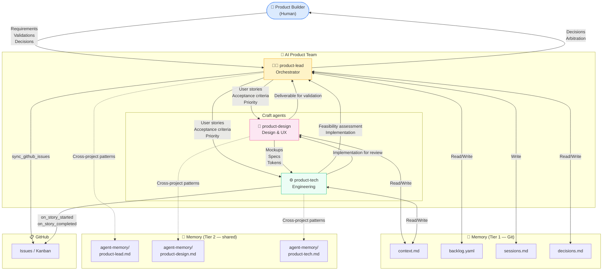
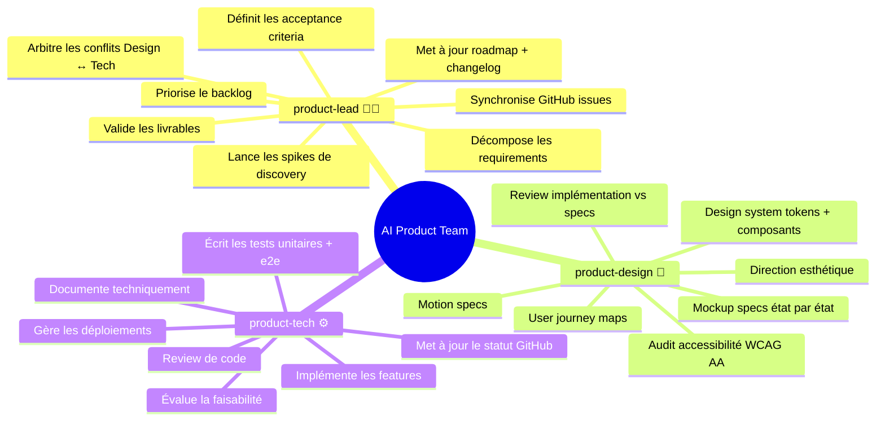
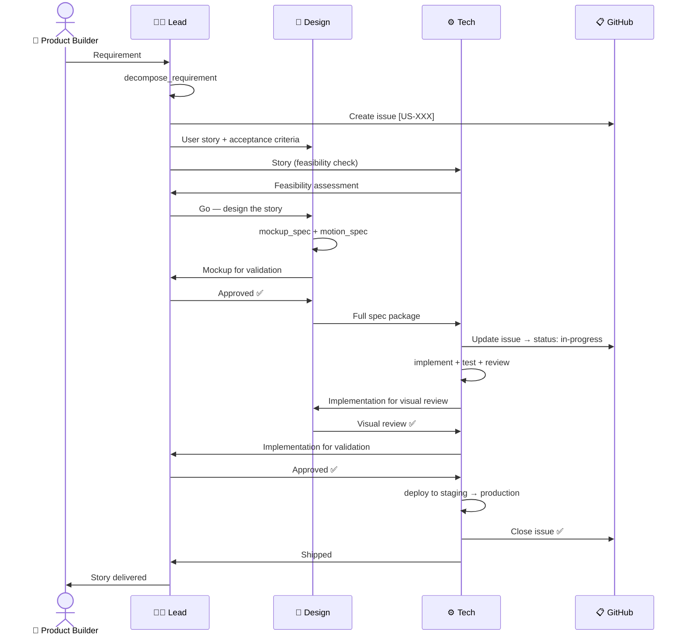
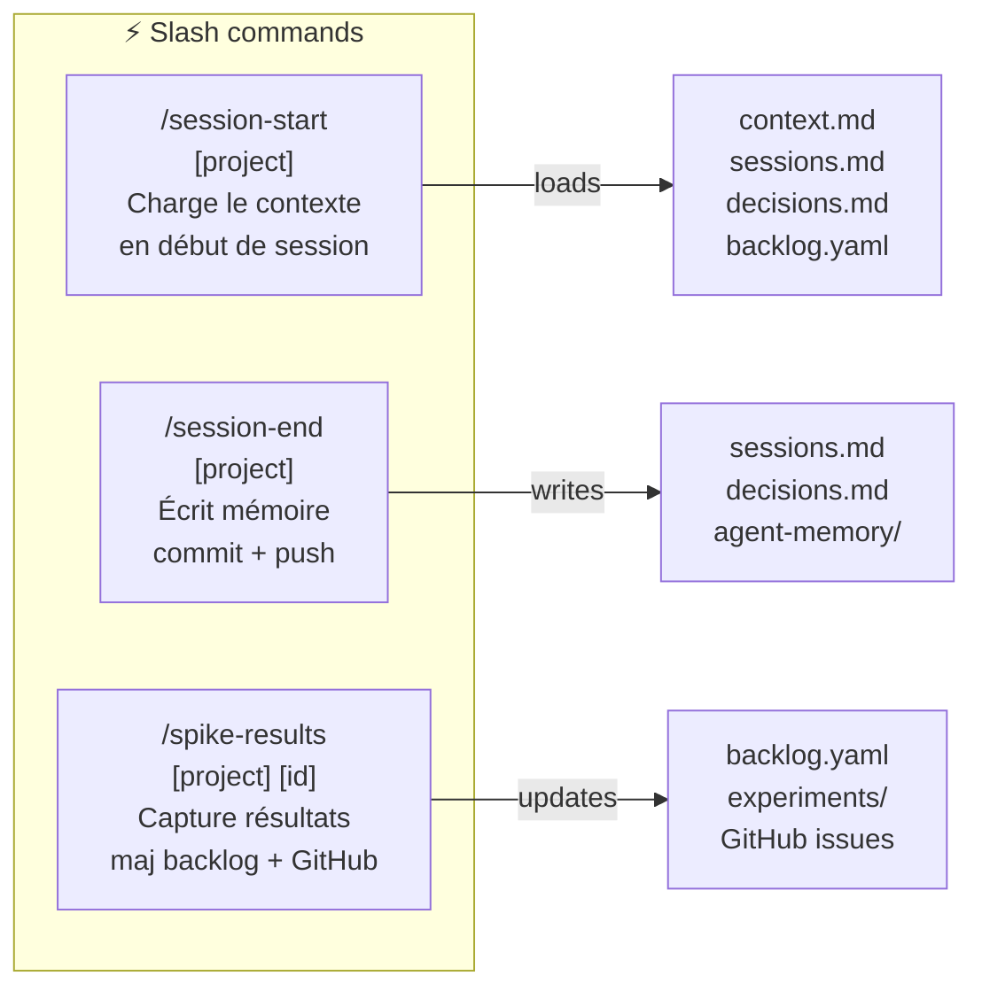

# Team Organisation — AI Product Agents
**Atelier — Rôles, responsabilités et interactions**
Last updated: 2026-04-17 (role: Product Owner → Product Builder)

## Organisation générale

## Responsabilités par agent

## Cycle de vie d'une user story

## Skills disponibles

