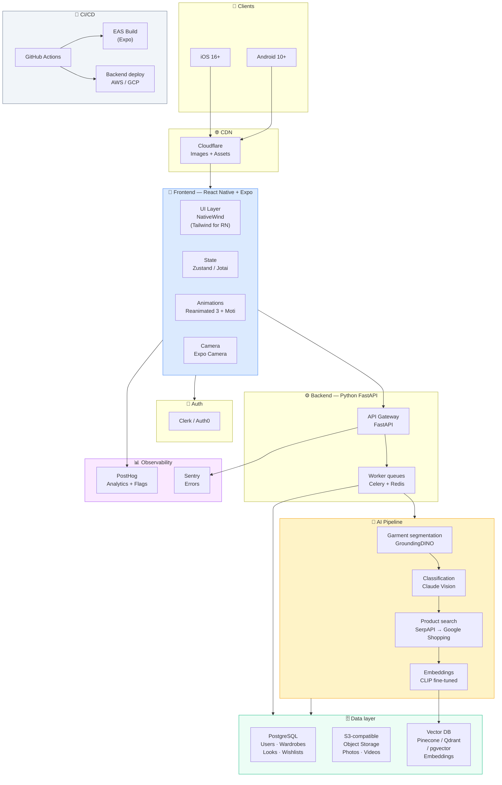
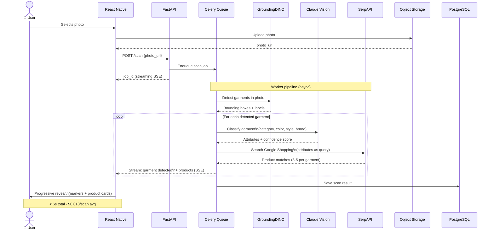
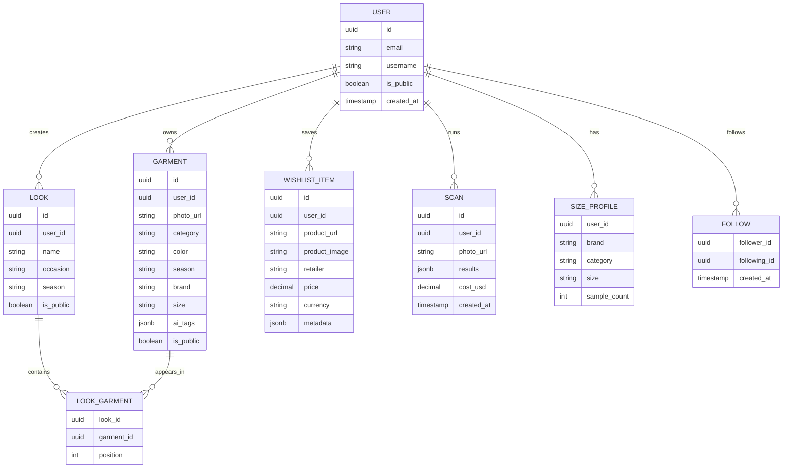
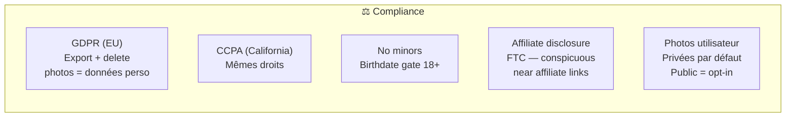

# Architecture Technique
**Atelier — Stack MVP**
Last updated: 2026-04-17

## Vue d'ensemble

## Pipeline AI — Scan d'un produit

## Modèle de données simplifié

## Budgets de performance

| Metric | Cible MVP |
|--------|-----------|
| App launch → home | < 2s cold / < 500ms warm |
| Photo upload → first result visible | < 6s |
| Wardrobe grid scroll (500+ items) | 60fps (virtualisé) |
| Image LQIP → full (4G) | < 300ms |
| AI inference cost / scan | < $0.02 |
| Infra cost / MAU (10k MAU) | < $0.50 |
| Daily scan limit | 10 scans/user |

## Contraintes légales & compliance

