# User Access Model
**Atelier — Anonymous vs Logged-in**
Last updated: 2026-04-17

```mermaid
flowchart LR
    subgraph ANON ["👤 Anonymous user\n(permanent mode — no expiry)"]
        direction TB
        A1["✅ Browse public profiles"]
        A2["✅ View looks & wardrobe items"]
        A3["✅ Tap affiliate product links"]
        A4["✅ Generate commission for Atelier"]
        A5["❌ Scan photos"]
        A6["❌ Build wardrobe"]
        A7["❌ Create looks"]
        A8["❌ Save to wishlist"]
        A9["❌ Like products"]
        A10["❌ Follow users"]
    end

    subgraph GATE ["🚪 Account gate\nTriggered by first save action"]
        direction TB
        G1["Like a product"]
        G2["Save to wishlist"]
        G3["Add to wardrobe"]
        G4["Start a scan"]
        G1 & G2 & G3 & G4 --> PROMPT["Bottom sheet prompt\n'Keep what you found.'\nCreate account · Maybe later"]
    end

    subgraph ACCOUNT ["🔐 Logged-in user"]
        direction TB
        B1["✅ Everything anonymous can do"]
        B2["✅ Scan photos\n(10/day at MVP)"]
        B3["✅ Build wardrobe\n+ mandatory size per item"]
        B4["✅ Create & browse looks"]
        B5["✅ Save to wishlist"]
        B6["✅ Like products → auto-adds to wishlist"]
        B7["✅ Follow users"]
        B8["✅ AI agent (full context)"]
        B9["✅ Size social proof\n(after 5+ wardrobe items)"]
    end

    subgraph SCAN ["🔍 Scan intent split\n(after results appear)"]
        direction TB
        SI1["'Add to wardrobe'\n→ size picker (mandatory)\n→ wardrobe"]
        SI2["'Save to wishlist'\n→ no size required\n→ wishlist"]
    end

    ANON -->|"wants to save"| GATE
    GATE -->|"creates account"| ACCOUNT
    GATE -->|"'Maybe later'\n(session continues)"| ANON
    ACCOUNT --> SCAN

    style ANON fill:#f0f9ff,stroke:#0ea5e9
    style GATE fill:#fef9c3,stroke:#eab308
    style ACCOUNT fill:#f0fdf4,stroke:#22c55e
    style SCAN fill:#faf5ff,stroke:#a855f7
```

## Access matrix

| Feature | Anonymous | Logged-in |
|---------|-----------|-----------|
| Browse public profiles | ✅ | ✅ |
| View looks & wardrobe | ✅ | ✅ |
| Tap affiliate links | ✅ | ✅ |
| Scan photos | ❌ | ✅ (10/day) |
| Build wardrobe | ❌ | ✅ + size mandatory |
| Create looks | ❌ | ✅ |
| Save to wishlist | ❌ | ✅ |
| Like products | ❌ (prompted) | ✅ → wishlist |
| Follow users | ❌ | ✅ |
| AI agent | ❌ | ✅ |
| Size social proof | ❌ | ✅ (after 5+ items) |

## Key decisions

- **Guest mode is permanent** — anonymous users can browse and generate commissions indefinitely
- **Account gate is soft** — "Maybe later" keeps the session alive, results not lost until app close
- **Scan requires account** — but onboarding allows one preview scan before the gate
- **Size is always mandatory** when adding to wardrobe — never optional at save time
